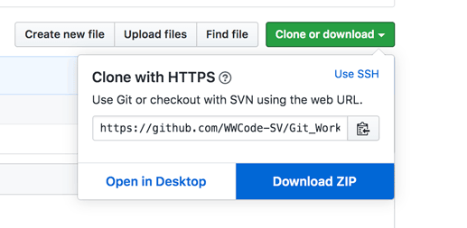
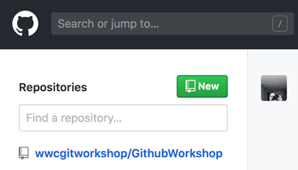
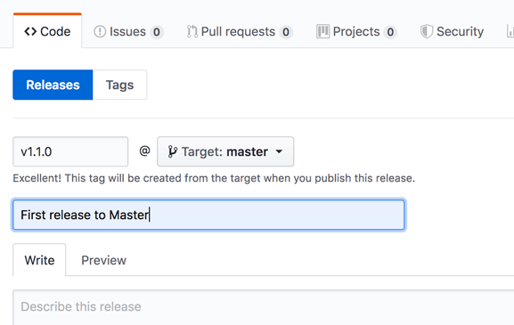

# advanced-git

## Set up your Repository

[Download the starting files](https://github.com/WWCode-SV/Git_Workshop)<br/>

<br/>

Go to your personal Github and creat a new repository<br/>

<br/>

Set up the repository:<br/>

<br/>

Clone file to your local file system

```bash
$ git clone https://github.com/<username>/<repo_name>
$ cd <repo_name>
```

Save the downloaded file to your new repo<br/>

Add and commit 
```bash
$ git add <file>
$ git commit -m "Inital commit"
$ git push
```


## Rebase from remote

Make a branch

```bash
$ git checkout -b feature-<branch>
```
commit something <br/>
commit something else<br/>
commit a thrid thing <br/>

Then switch to the original branch
```bash 
$ git checkout master
$ git git pull
```
Create a new file and add / commit / push
```bash
$ git add <file>
$ git commit
$ git push
```

Now checkout your branch to rebase
```bash
$ git checkout feature-<branch>
$ git log --oneline
$ git diff origin/master
$ git rebase origin/master
$ git log --oneline
```
*note the difference in your commit history*

## Rebase -i
**Switch the order of two commits**

```bash
$ git rebase -i HEAD~3
```

	pick ##### Moving up
	pick ##### Moving down
	*save and close*

**Reword one of the comments in your comment**<br/>
*allows you to change you comment, but not the commit itself*
```bash
$ git rebase -i HEAD~3
```

	reword ##### Adding better messaging 
	*save and close*

Edit commit message *save and close*

```bash
$ git log --oneline
```

**Edit commit**<br/>
*allows you to change the commit itself*
```bash
$ git rebase -i HEAD~5 
```

	edit ###### Commit you want to change 
	*save and close*

```bash
$ git commit --amend 
$ git reset HEAD^
$ git status
$ git add <file>
$ git commit *add new messaging*
$ git add <file>
$ git commit *add new messaging*
$ git rebase --continue
$ git log --oneline
```


**Squash commit**<br/>
*allows you to combine commits*
```bash
$ git rebase -i HEAD~2 
```

	pick ###### Commit you'd like to keep
	squash ###### Commit you want to squash
	*save and close*


## Stash <br/>
*allows you to temporarily 'stash' changes in order to perform another command*

```bash
$ git fetch origin
```

	error: cannot rebase: You have unstaged changes.
	error: Please commit or stash them.

```bash
$ git stash
```

```bash
$ git fetch origin
```
*update files*

```bash
$ git stash list
$ git stash apply stash@{#}
$ git add . 
$ git commit
git log --oneline
```


## Reset 
**Reset a staged file**<br/>

Make a change to your text file<br/>
Check the status
```bash
$ git status
```

View the Staging Index
```bash
$ git ls-files -s
```
>ls-files is a utility for inspecting the Staging Index. Adding -s or --stage flag gives us the SHA-1 hash

Add your change file to Staging
```bash
$ git add <file>
```
Now view the Staging Index and note the change to your file
```bash
$ git ls-files -s
```
Unstage the file, and review the status
```bash
$ git reset HEAD <file>
$ git status 
```
> TIP: By default, *git reset* uses --mixed option. This will remove the changed file from staging, but NOT reset the changes. If you used the --hard option, you will reset your working copy to match the HEAD or HASH selected.

**Hard Reset**<br/>
Make a change to your text file and add it to staging<br/>
```bash
$ git add <file>
$ git status 
```
Now reset the changes 
```bash
$ git reset HEAD --hard
```
*Note that your changes are reset to the HEAD commit*

**Reset a commit**<br/>
Make a change to your text file. Then add and commit the file.
```bash
$ git add <file>
$ git commit
$ git log --oneline 
```
*Note in the log file that your recent commit is the HEAD* <br/>
reset to the previous commit
```bash
$ git reset ##### <file>
$ git log --oneline 
```
*Note the previous commit is now the HEAD*

Make additonal changes to the file
```bash
$ git add <file>
$ git commit
$ git log --oneline 
```
*Note in the log file that your NEW commit is the HEAD* <br/>

>TIP: reset is best for LOCAL files only. If you need to make changes to a public commit, use revert instead.

 
## Merge

Checkout master and create a new branch<br/>
```bash
$ git checkout master
$ git fetch
$ git checkout -b feature-<branch>
```
Add a new file, commit it, and push to the remote<br/>
```bash
$ git add <file>
$ git commit
$ git push --set-upstream origin feature-<branch>
```
Create a PR for your new file additions in Github<br/>

<br/>

Reivew and merges Pull Request<br/>

<br/>

Rebase local branch to get updates from master branch<br/>
```bash
$ git rebase origin/master
$ git log --oneline
```

Choose people to make updates to the same files<br/>

Commits and push the file

```bash
$ git add <file>
$ git commit
$ git push
```
Create a PR for your changes in Github<br/>

Team lead merges PRs, and resolves conflicts with the developers<br/>

Continue with all files<br/>


## Revert
**Team Exercise**
Add a "Bug" to your file<br/>
Save and commit your changes<br/>
```bash
$ git add <file>
$ git commit
$ git push
```
Make another, no conflicting change<br/>
Save and commit your changes<br/>
```bash
$ git add <file>
$ git commit
$ git push
```
Revert your bug <br/>
```bash
$ git log --oneline
$ git git revert ######
$ git log --oneline
$ git push
```
Review the commit history in Github


## Cherry pick
Create a new branch 
```bash
$ git branch feature-<branch>
```
Make a change to one file, and add/commit it 
```bash
$ git add <file>
$ git commit 
```
Make a change to another file, and add/commit it
```bash
$ git add <file>
$ git commit 
```
Log the file to get the SHA-1 of the commit you want to cherry pick
```bash
$ git log --pretty=oneline
```
Now such to your other branch and pick out the commit
```bash
$ git checkout feature-<branch>
$ git cherry-pick <SHA-1>
```
*Note your current branch contains online the change from the commit you picked* <br/>

Commit your changes 
```bash
$ git commit 
```
Now if we want, we can revert the unwanted commit <br/>
Checkout the new branch, find the appropriate HASH, and revert the change
```bash
$ git checkout feature-<branch>
$ git log --oneline
$ git revert #####
$ git commit 
```
*Note your unwanted commit has been reverted*<br/>
Now we can rebase with the other branch 
```bash
$ git rebase <branch>
```


## Tag
Now that we are done with our work, we are ready to create a *Release*<br/>
First, merge the most current changes into master and push to the remote
```bash
$ git checkout master
$ git merge feature-<branch>
$ git push 
```

Next go to your Github account and Tag the Release

<br/>

Now we can view the Tags in Github<br/>


Or review the tags in your terminal
```bash
$ git tag -l
$ git checkout tags/<tag_name>
```


